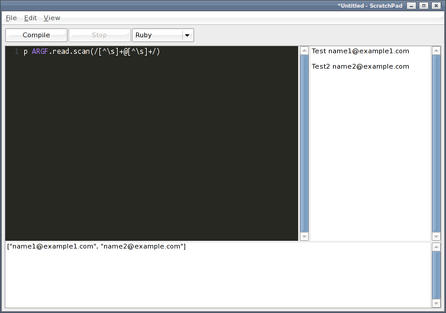

ScratchPad
==========

A simple editor to quickly edit and run programs without needing workspaces, projects, or files.
Useful for running an [SSCCE](http://sscce.org).

Features
--------

* Compile/Run multiple languages.
* Configurable languages.
* Command-line options.
* Open/Save file.
* Convertion of spaces and tabs.
* Edit standard input stream.
* Smart home/end.
* Block indent/unindent.
* Line numbers.
* Syntax highlighting.
* Undo/Redo.
* Complile/Run with Ctrl+Enter, delete line with Ctrl+D, move line with Alt+Up/Down, scroll with Ctrl+Up/Down.

Installation
------------

* Replace lib/swt.jar with your platform specific library from: from http://www.eclipse.org/swt/.

* Configure languages in src/compiler/languages.xml

* Build with ant:

        ant jar
    
Usage
-----

    java -jar scratchpad.jar [-cp classpath] [-f filename] [-j jardir] [-l language] [-h] [filename]
